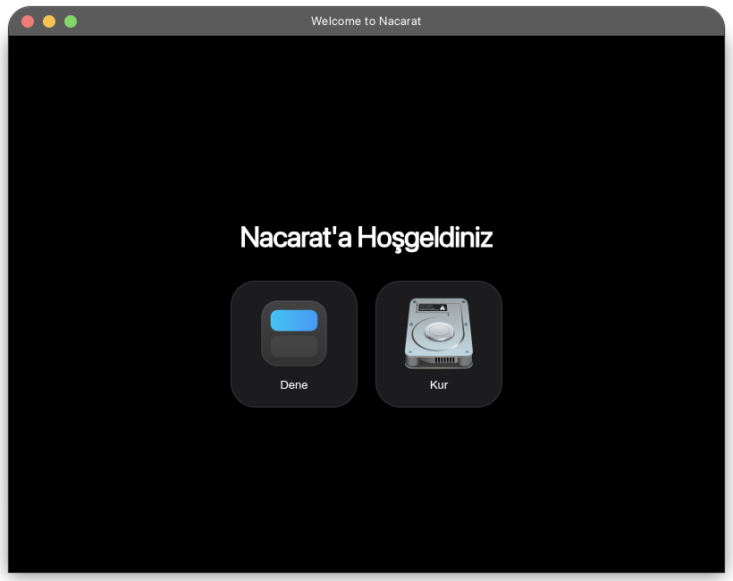
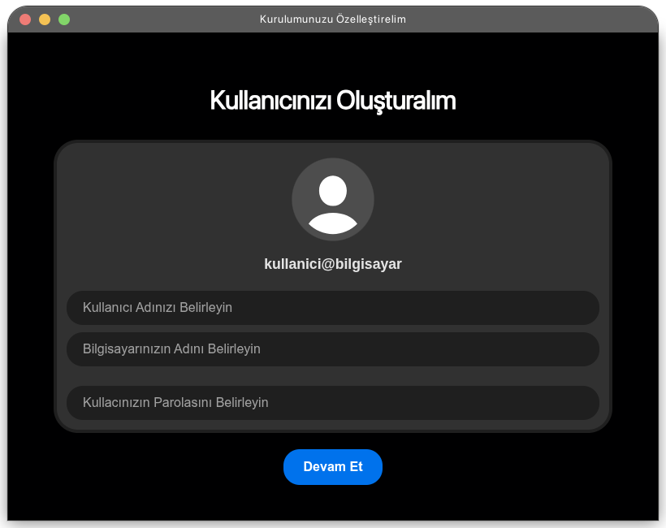
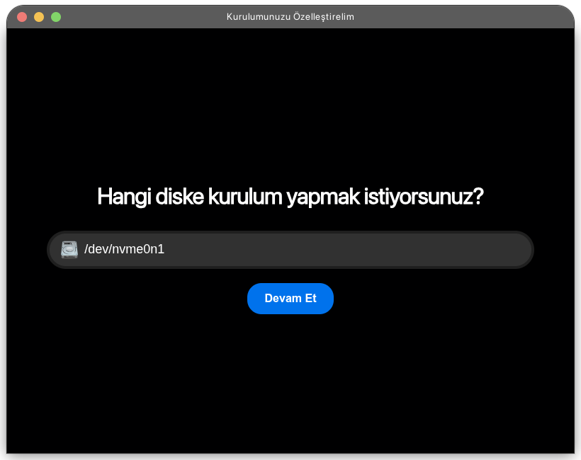
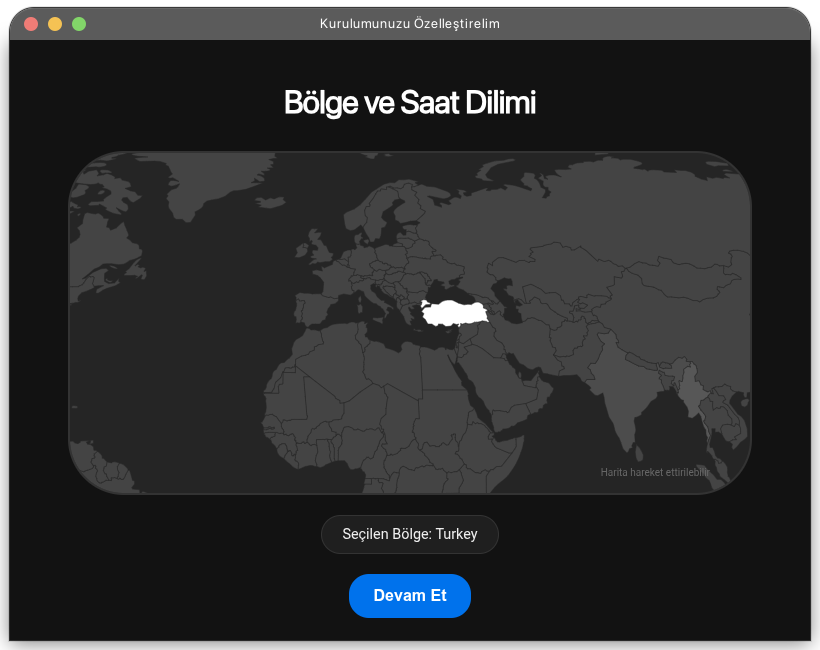

<h1 style="text-align: center;">NacaratOS Welcome</h1>

The modern, minimalist, and user-friendly first-time setup and installer application for Nacarat OS. 

This project aims to enable users to setup and manage their systems without even opening a terminal.

## Features

> Including frontend

1. Modern and Minimalist Interface: macOS-style window controls and a sleek dark theme design that ensures a clean user experience.

2. Hybrid Architecture: High-performance and reliable shell scripts running on the backend, coupled with a flexible and modern Electron frontend.

3. System Performance Mode: A hardware preset slider that allows users to configure the system balance between efficiency and performance during setup.

  | Welcome & Disk | User & Regional |
  | :---: | :---: |
  |  |  |
  |  |  |

## How to run

1. Clone the repo:
   ```bash
   git clone https://github.com/nacaratOS/welcome
   cd welcome
   ```
2. Install dependencies:
   ```
   npm install
   ```
3. Run
   ```bash
   npm start
   ```

## Credits

<a href="https://github.com/GamerCinarTR">
  
</a>
&nbsp;&nbsp;
<a href="https://github.com/YusufErdemK">
  
</a>

Made by Çınar Ali & Erdamn.